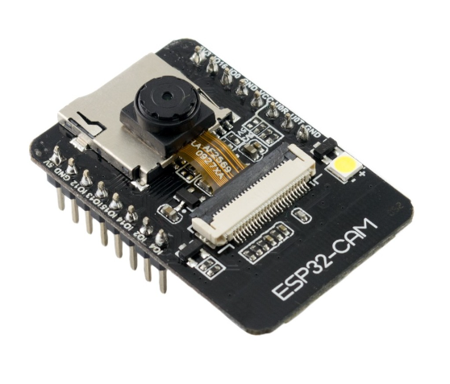
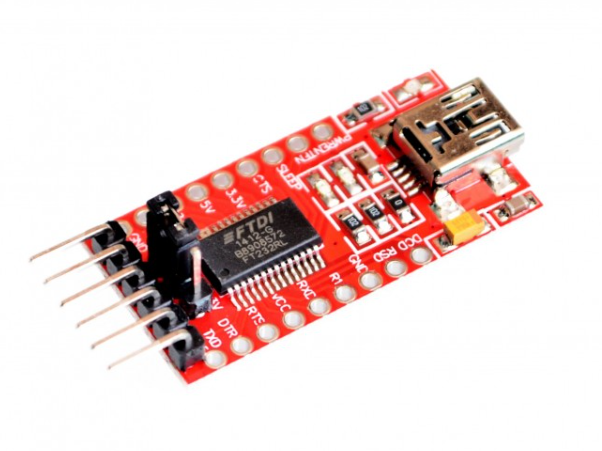
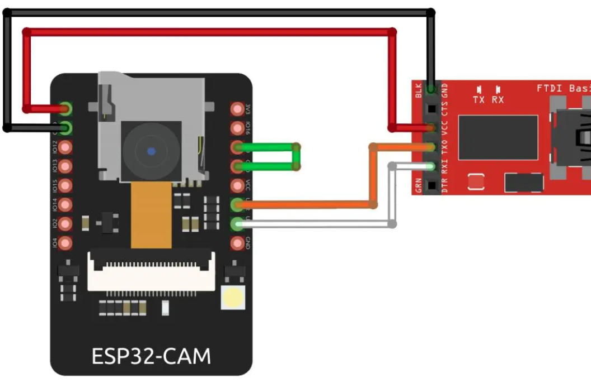
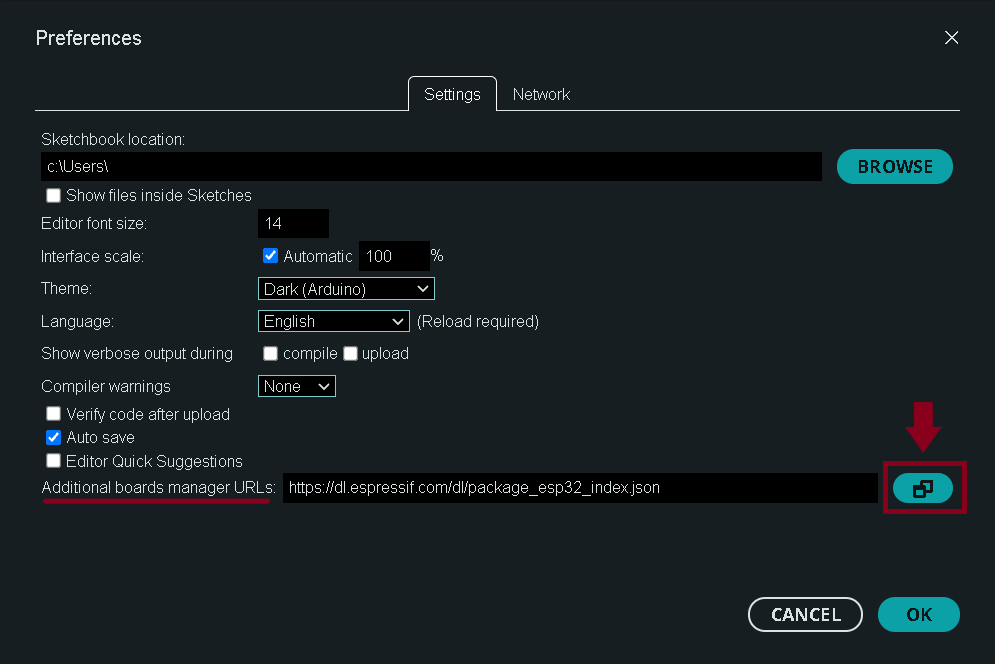
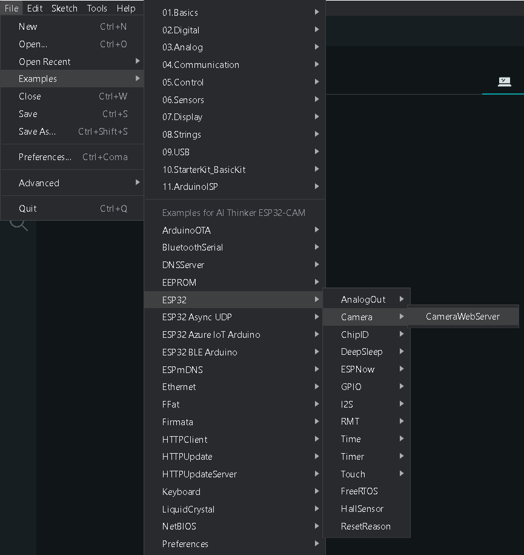
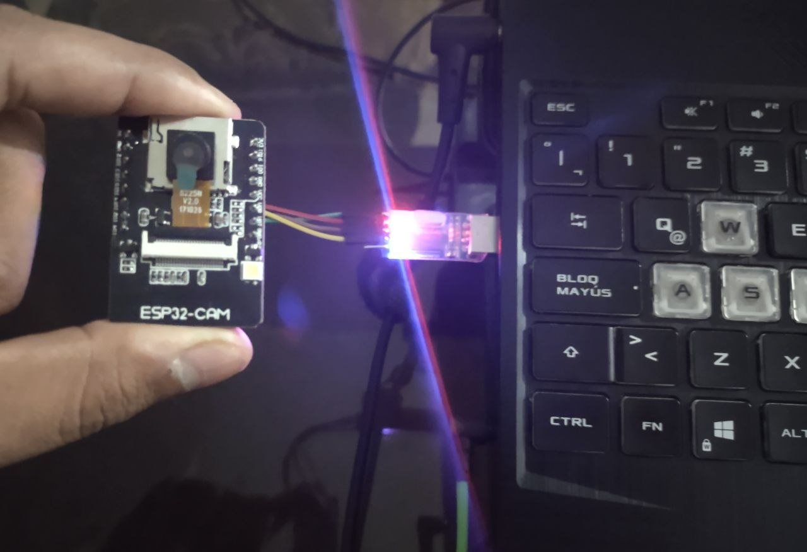
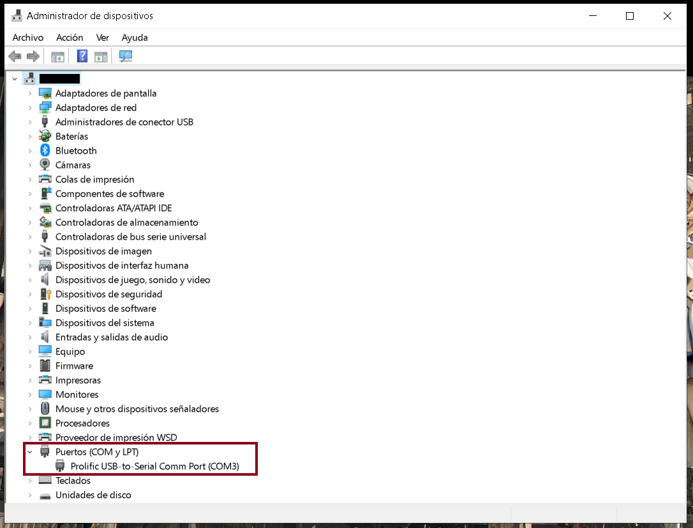
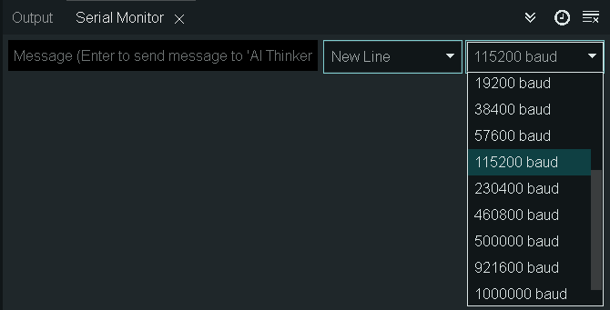

<!-- headings -->
# ESP32-CAM
## Descripcion
El dispositivo ESP32-CAM es un microcontrolador todo en uno, es decir que además de ser el componente principal de una aplicación embebida, la realización de estas es más sencilla puesto a que varias de las necesidades en cuanto a funciones se refieren es cubierta por esta misma. Poniendo en evidencia, el ESP32CAM lleva integrado una pequeña cámara de video, conexión WiFi y Bluetooth además de un puerto para una tarjeta MicroSD.



Dado que este dispositivo ESP32-CAM se encuentra en un rango de precio accesible, este pretende ser un perfecto candidato para la investigación audiovisual y toma de datos, ofreciendo aplicaciones típicas como: Reconocimiento Facial, toma de fotos y detección de movimiento.
## Integracion Arduino
### Esquema FTDI
Conocido como “Future Technology Devices International Limited”, el adaptador FTDI será de gran utilidad para la programación de nuestro dispositivo ESP32-CAM puesto a que lleva una interfaz integrada USB desde el cual podremos trabajar desde el ordenador.



### Conexiones
Para la utilización de nuestro dispositivo ESP32-CAM es necesario realizar conexiones entre nuestro dispositivo y un adaptador FTDI que usualmente viene incluido.



Puente en el módulo ESP32-CAM entre GPIO - GND
<!-- TABLES -->
| Módulo       | ESP32-CAM         |FTDI   |
| ------------- |:-------------:| :--------:|
| 1        | 5V          | VCC         |
| 2        | GND         | GND         |
| 3        | GPIO 3      | TX0         |
| 4        | GPIO 1      | RXI         |

### Procedimiento
El uso del dispositivo se puede dar desde distintas plataformas, ya sea Python o Arduino, siendo nuestro caso este último requeriremos una versión actualizada de la plataforma IDE Arduino en la cual realizaremos algunas configuraciones.
### Configuración en Arduino IDE
* Nos situamos en “Menú > archivo > preferencias” insertando la siguiente URL: "https://dl.espressif.com/dl/package_esp32_index.json"
  
  

* Proseguimos con la instalación del paquete de recursos AI thinker en “Menú > Herramientas > Tabla > esp32 > AI Thinker ESP32-CAM”.
  
  

* Posteriormente, la interfaz de Arduino IDE tiene un ejemplo predefinido para la utilización de la cámara del ESP32-CAM en la cual incluye Codigo C, localizándose en “Menú > archivo > ejemplos > ESP32 > cámara > CameraWebServer”.



### Configuración en Ejemplo.c
Si bien para el uso de la aplicación predefinida de la cámara, la interfaz Arduino IDE nos provee un ejemplo, tenemos que hacer pequeños cambios en este para su correcto uso.
* Inicialmente tendremos que comentar el modelo de cámara y aplicación que viene definido
    ```c
    #define CAMERA_MODEL_WROVER_KIT // Has PSRAM
    ```

    Y descomentar el cual estaremos utilizando "AI Thinker"
    ```c
    //#define CAMERA_MODEL_AI_THINKER // Has PSRAM
    ```
* Adicionalmente, en nuestro código C se indica que el video se da de manera remota, necesitaremos conectarnos a una red WiFi, siendo el usuario y contraseña editados en
    ```c
    #include "camera_pins.h"

    const char* ssid = "Usuario WiFi";
    const char* password = "Contraseña WiFi";
    ```
    Esto será necesario puesto a que el video es transmitido a una IP autogenerada.
### Ejecución del programa
Una vez realizados los ajustes tanto para la aplicacion Arduino IDE como para el código del programa, conectamos nuestro ESP32-CAM y subimos el código, podremos verificar la subida de datos tanto en la aplicacion Arduino IDE como visualmente en el dispositivo puesto a que este emitirá una luz led intermitente además de la estacionaria.



Una vez completada la subida de datos, nos deberia salir algo similar en la consola:
```
Writing at 0x00008000... (100 %)
Wrote 3072 bytes (119 compressed) at 0x00008000 in 0.1 seconds (effective 196.6 kbit/s)...
Hash of data verified.

Leaving...
Hard resetting via RTS pin...
```

Indicando que deberiamos resetear el dispositivo, una vez hecho esto el programa correrá por si solo, por lo que desconectamos el puente GPIO y GND realizado anteriormente y procedemos a resetear el dispositivo manteniendo al menos 3 segundos el boton RST.
Una vez realizado estos pasos en la ventana Serial Monitor ubicada al lado de la consola nos deberia digitar lo siguiente:
```
WiFi connected
Starting web server on port: '80'
Starting stream server on port: '81'
Camera Ready! 
Use 'http://111.111.11.111' to connect
```
Mostrando una satisfactoria conexión entre la red WiFi y el dispositivo ESP32-CAM, generandonos una dirección http a la cual podremos acceder desde cualquier buscador.
Una vez accedemos a la IP autogenerada, deberia mostrarnos lo siguiente:


Siendo capaces de configurar ciertas características de la cámara como brillo, contraste, saturacion, etc. desde internet alcanzando un máximo de 1600x1200 de resolución para una cámara básica de 2 megapíxeles.

### Consideraciones
* Dado que para nuestra utilización del dispositivo    ESP32-CAM utilizamos un adaptador FTDI, necesitaremos instalar los drivers adecuados para el reconocimiento de estos y así poder continuar con la asignación de un puerto de nuestro ordenador con el cual trabajaremos posteriormente.
    

    Además, hay que tener en cuenta la tasa de bits por segundo a la que trabaja nuestro ESP32-CAM siendo usualmente 115200 baud, para esto nos situamos en la pestaña “Monitor serie”
    
* El puente realizado entre GPIO y GND en el ESP32-CAM es necesario antes de conectar el dispositivo si se quiere cargar algun programa o actualización y desconectar despues de la lectura y subida de datos para el reseteo posterior.
* Hay que tener en cuenta las limitaciones del equipo, dado que estamos trabajando con WiFi, bluetooth integrado, el alcance de estos no es muy extenso, por lo que aún habiendose subido el programa y reseteado el dispositivo ESP32-CAM correctamente es posible que no te de video debido a la conexión, para asegurarnos un calidad asequible es preferible que nuestra red WiFi se encuentre a una corta distancia.
* Si se quiere realizar video o hacer cambios en la configuración de la cámara vía internet, se requiere que la conexión WiFi a la que se accede desde el buscador sea a la misma dirección  a la que esta conectado el ESP32-CAM.
* El ejemplo provisto por la aplicación Arduino IDE solo permite un dispositivo conectado a la cámara, por lo que si algun tercero intenta conectarse a esta, el acceso a la cámara estará dado por el primer dispositivo en conectarse a esta misma.


<!-- Mentiosn -->
